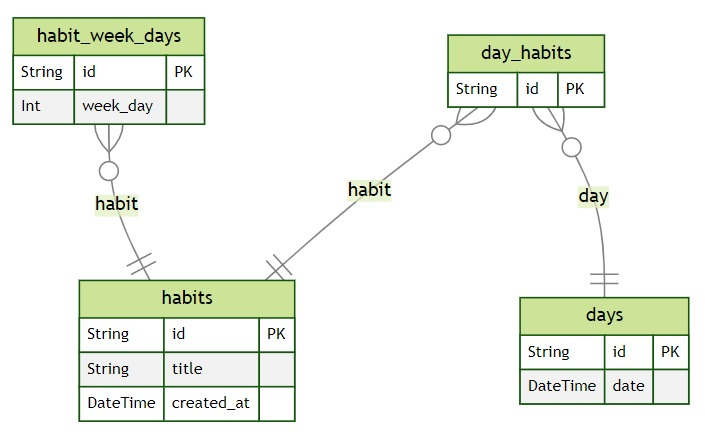
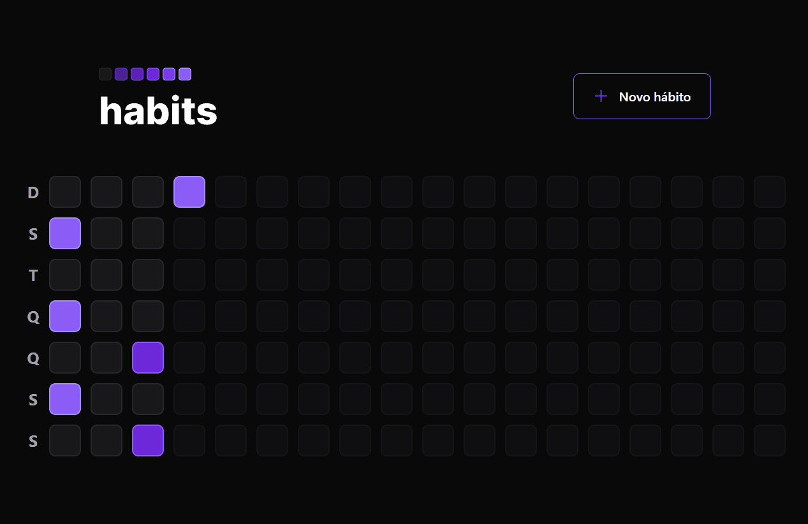

# NLW - Setup
#### _Trilha Ignite_
Aplicação desenvolvida durante o bootcamp NLW-Setup, oferecido pela Rocketseat durante os dias 16 a 20 de janeiro de 2023, lecionado pelos professores Diego Fernandes e Rodrigo Gonçalves.

             

## Descrição
O projeto é uma aplicação para registros diários de hábitos do usuário, permitindo também o cadastro de novos hábitos e a visualização de hábitos concluídos ao longo do ano. O código foi todo escrito em **TypeScript**, tanto no front-end quanto no back-end em **NodeJS**.

O ambiente do *server* foi feito utilizando o framework [Fastify](https://www.fastify.io/) para fazer o roteamento da aplicação. Para fazer a comunicação com o Banco de Dados (DB), foi utilizado um *Object-Relational Mapping* (ORM) chamado [Prisma](https://www.prisma.io/), que converteu todo o código de TypeScript para SQL, nos padrões de DB do SQLite.


O ambiente de desenvolvimento da versão *web* foi feito utilizando o [Vite](https://vitejs.dev/), para dar o suporte ao TypeScript e à biblioteca ***React***. Alguns componentes como o *popover* para visualizar os dados do dia e o *dialog* para cadastrar novos hábitos, foram feitos usando os componentes da biblioteca [Radix](https://www.radix-ui.com/), para garantir que essas funcionalidades ofereçam acessbilidade para portadores de deficiência visual. A estilização em sua maior parte foi feita com as classes do framework ***Tailwind CSS***, mas em alguns momentos utilizamos o pacote [CLSX](https://www.npmjs.com/package/clsx), para fazer estilizações condicionais.


O ambiente da versão *mobile* por sua vez foi feito utilizando o [Expo](https://docs.expo.dev/), para dar suporte ao **React Native** e garantir acesso aos recursos nativos dos aparelhos dos usuários. A estilização também foi feita com Tailwind, mas na sua versão específica para o React Native, o [Nativewind](https://docs.expo.dev/tutorial/introduction/). Outros pacotes como o [expo-fonts](https://docs.expo.dev/guides/using-custom-fonts/), [react-native-svg](https://docs.expo.dev/versions/latest/sdk/svg/), [react-native-svg-transformer](https://github.com/kristerkari/react-native-svg-transformer) e [CLSX](https://www.npmjs.com/package/clsx) também foram adicionados ao projeto, para complementar a estilização.


## Instruções
A página incial é um sumário com todos os dias do ano, com uma escala de cores de cinza para roxo claro, definidas conforme o número de hábitos concluídos pelo usuário no dia. Quanto menos hábitos o usuário concluir, mais escuro fica o roxo.

Ao clicar no quadradinho que representa cada dia, é possível ver os hábitos concluídos dos dias anteriores, mas não é possível alterá-los. Só é possível selecionar como feitos os hábitos do dia atual.

No cabecalho temos um botão que permite a criação novos hábitos, com um checkbox para selecionar os dias da semana que esses hábitos deverão ser feitos.

É possível verificar o conteúdo de cada aulao, selecionando a *branch* específica e o histórico de [commits].

> Caso você seja um desenvolvedor, use as instruções abaixo para instalar as dependências e sugerir alterações para a aplicação.

Após baixar o projeto deste repositório, dentro do diretório de cada parte do projeto (server, web e mobile), você deve usar o comando `npm install` no terminal, para gerar a pasta **node_modules** de cada uma. Ou seja, será necessário abrir três janelas do editor de código, para rodar cada parte individualmente.

```sh
npm install
```
Concluída a instalação das dependências do projeto, use o comando `npm run dev` para visualizar a aplicação na porta definida pelo **Vite** (basta clicar no link exibido no terminal). Para a pasta do servidor, use o mesmo comando `npm run dev` e projeto irá usar a porta [localhost:3333](http://localhost:3333) para rodar o servidor.
```sh
npm run dev
```
Para visualizar o projeto mobile, é necessário instalar o aplicativo **Expo Go** e estar conectado na mesma rede wi-fi do computador que está rodando o projeto. Em seguida, na pasta do mobile, será necessário usar o comando `npx expo start` para que o Expo gere um QR-code, que será usado para conectar o projeto ao aplicativo instalado no celular.
```sh
npx expo start
```

[//]: # (These are reference links used in the body of this note and get stripped out when the markdown processor does its job. There is no need to format nicely because it shouldn't be seen. Thanks SO - http://stackoverflow.com/questions/4823468/store-comments-in-markdown-syntax)

[commits]: <https://github.com/PedroPaivaDev/nlw-setup-ignite/commits/main>